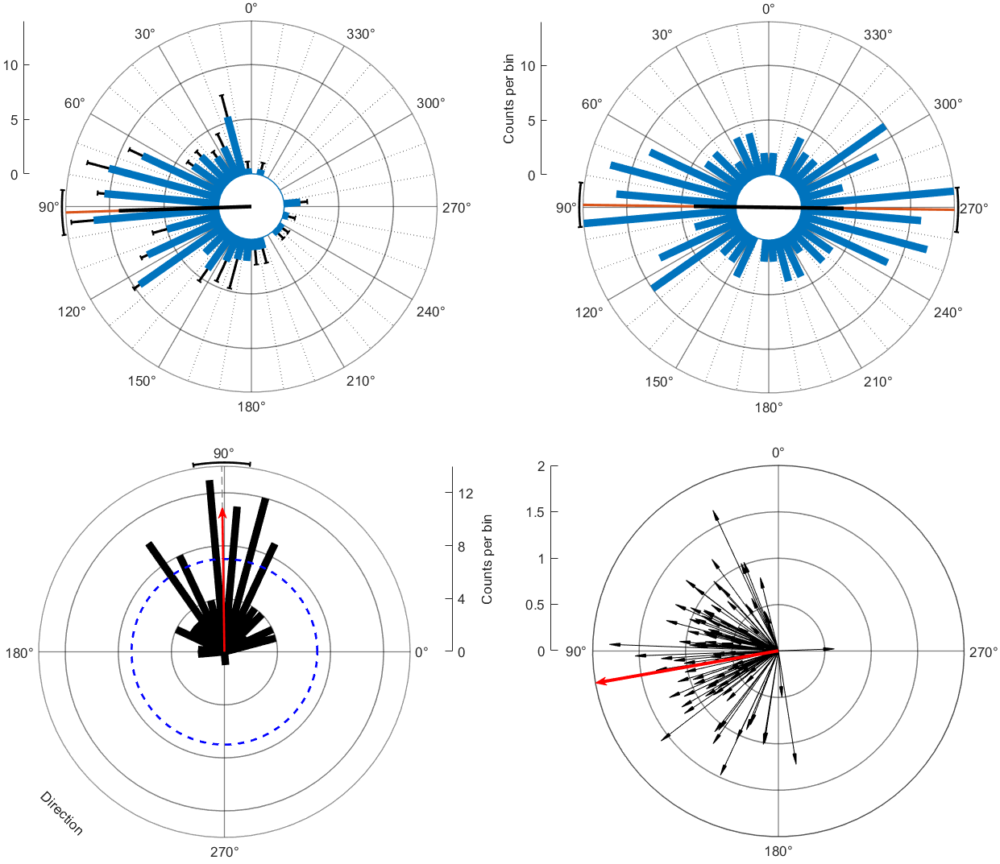

# CircHist
`CircHist` - circular / polar / angle histogram in MATLAB

`CircHist` creates circular (polar) histograms from angle data, either distribution data or already-binned data. Works with circular and axial (bimodal) data. Circular statistics (average angle, 95 % confidence interval, resultant vector length, Rayleigh test of uniformity and circular-linear correlation) are automatically calculated using the `CircStat` Toolbox and are graphically included. All visual properties can be dynamically adjusted; see __@CircHist/html/exampleCircHist.html__ for usage examples.
This function is conceptually similar to MATLAB's `rose` and `polarhistogram` functions, but differs from them in several respects:
- Instead of plotting the histogram bins as wedges, they are plotted as straight bars.
- The histogram bins can have error bars.
- The radius-axis scale is shown as a straight scale next to the plot.
- Circular statistics are automatically computed.
- Arrows with specific direction and length can be overlayed.
